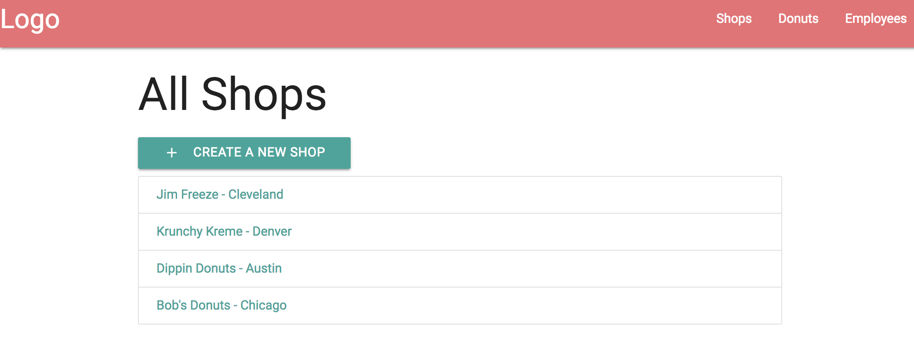
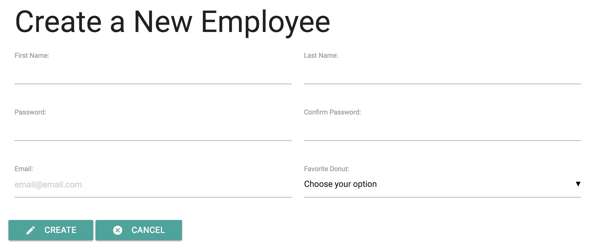
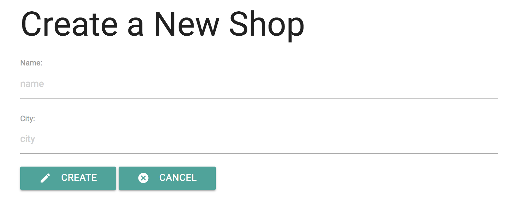
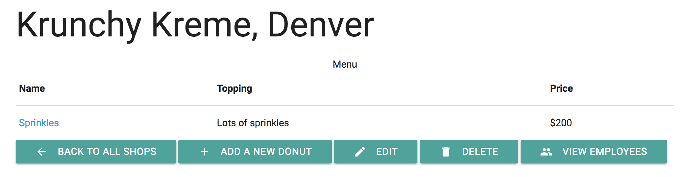
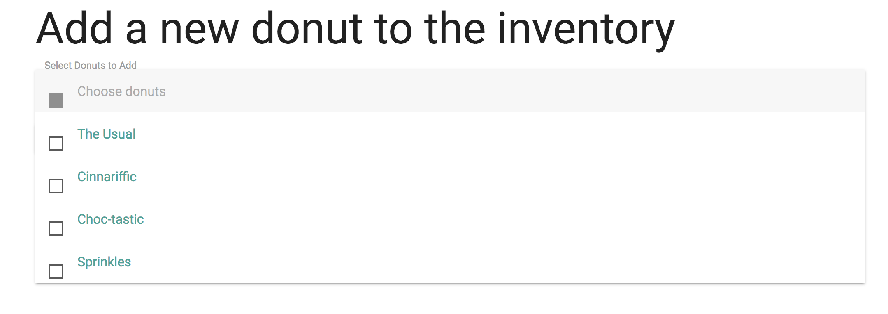

# Donut Tycoon

A full stack app built in Javascript to simulate an inventory and employee management system for a small business.

Users can create shops, creating inventory items, and employees.



Once created, the user can then manage those stories by editing employees and updating a given store's inventory.




## Getting Started
The project can be cloned locally, with the Postgres database setup and seeded via Knex:

```
git clone https://github.com/wittrura/DonutTycoon.git
cd DonutTycoon
npm install
knex migrate:latest
knex seed:run
npm start
```

### Prerequisites
PostgreSQL - after install, the script file will create the required databases in Postgres and seed the tables.

### Installing
Additional information regarding installing Postgres is available at [the Postgres website](https://www.postgresql.org/download/). There are both command line and GUI options.

## Running the tests
Tests are set up in Mocha to validate API calls, and exectuded by running `npm test` in the terminal.


### Coding style tests
Included linter follows the Airbnb JavaScript style guide

## Deployment
This project is currently set up to be deployed on Heroku, and a live link is included in the project description.

To deploy, the [Heroku Postgres add-on](https://elements.heroku.com/addons/heroku-postgresql) must be installed on your dyno.

## Built With
* [Node](https://nodejs.org/en/) - Backend server
* [Express](http://expressjs.com/) - Backend server, routing, middleware
* [Knex](http://knexjs.org/) - SQL query builder
* [PostgreSQL](https://www.postgresql.org/) - SQL database
* [Mocha](https://mochajs.org/) - server-side API testing
* [Chai](http://chaijs.com/) - BDD / TDD assertion library
* [Airbnb](https://github.com/airbnb/javascript) - JavaScript style guide, for use with linter
